# Архитектура TeamFinder — вариант 2 «Навыки пользователей и фильтрация участников по навыкам»

**Обозначения на схемах**

| Обозначение | Смысл |
|---|---|
| `{id}`, `{skill_id}` | параметр пути, в `urls.py` это `<int:...>` |
| сплошная стрелка `-->` | вызов, запрос или импорт |
| пунктирная стрелка `-.->` | неявная связь (наследование шаблона, настройка, раздача файлов) |
| цилиндр | хранилище (БД, файловая система) |
| ромб | ветвление или проверка |

## Содержание

1. [Общая схема системы](#1-общая-схема-системы)
2. [Слои приложения](#2-слои-приложения)
3. [Структура проекта](#3-структура-проекта)
4. [Граф зависимостей модулей](#4-граф-зависимостей-модулей)
5. [Модель данных](#5-модель-данных)
6. [Маршрутизация URL → View → ответ](#6-маршрутизация-url--view--ответ)
7. [Жизненный цикл HTTP-запроса](#7-жизненный-цикл-http-запроса)
8. [Шаблоны: наследование, включения, контекст](#8-шаблоны-наследование-включения-контекст)
9. [Frontend: JS-модули и AJAX](#9-frontend-js-модули-и-ajax)
10. [Ключевые сценарии](#10-ключевые-сценарии)
11. [Разграничение прав](#11-разграничение-прав)
12. [Навигация между страницами](#12-навигация-между-страницами)
13. [Конфигурация и окружение](#13-конфигурация-и-окружение)
14. [Нюансы и расхождения между ТЗ, docs и шаблонами](#14-нюансы-и-расхождения-между-тз-docs-и-шаблонами)

---

## 1. Общая схема системы

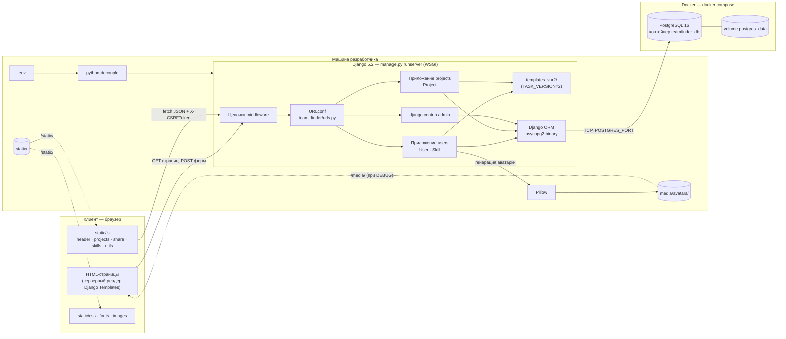
```mermaid
flowchart LR
    subgraph CLIENT["Клиент — браузер"]
        HTML["HTML-страницы<br/>(серверный рендер Django Templates)"]
        JS["static/js<br/>header · projects · share · skills · utils"]
        CSS["static/css · fonts · images"]
    end

    subgraph HOST["Машина разработчика"]
        subgraph DJ["Django 5.2 — manage.py runserver (WSGI)"]
            MW["Цепочка middleware"]
            URL["URLconf<br/>team_finder/urls.py"]
            USERS["Приложение users<br/>User · Skill"]
            PROJ["Приложение projects<br/>Project"]
            ADMIN["django.contrib.admin"]
            TPL["templates_var2/<br/>(TASK_VERSION=2)"]
            ORM["Django ORM<br/>psycopg2-binary"]
        end
        ENV[".env"]
        DEC["python-decouple"]
        STATIC[("static/")]
        MEDIA[("media/avatars/")]
        PIL["Pillow"]
    end

    subgraph DOCKER["Docker — docker compose"]
        PG[("PostgreSQL 16<br/>контейнер teamfinder_db")]
        VOL[("volume postgres_data")]
    end

    HTML -- "GET страниц, POST форм" --> MW
    JS -- "fetch JSON + X-CSRFToken" --> MW
    MW --> URL
    URL --> USERS & PROJ & ADMIN
    USERS & PROJ --> TPL
    USERS & PROJ & ADMIN --> ORM
    ORM -- "TCP, POSTGRES_PORT" --> PG
    PG --- VOL
    ENV --> DEC --> DJ
    USERS -- "генерация аватарки" --> PIL --> MEDIA
    STATIC -. "/static/" .-> CSS
    STATIC -. "/static/" .-> JS
    MEDIA -. "/media/ (при DEBUG)" .-> HTML
```

**Стек:** Django 5.2.4, PostgreSQL 16 в Docker, psycopg2-binary, Pillow (аватарки), python-decouple (`.env`).
Фронтенд рендерится на сервере; интерактивные действия (навыки, участие, завершение проекта) идут через `fetch` к JSON-эндпоинтам.

---

## 2. Слои приложения

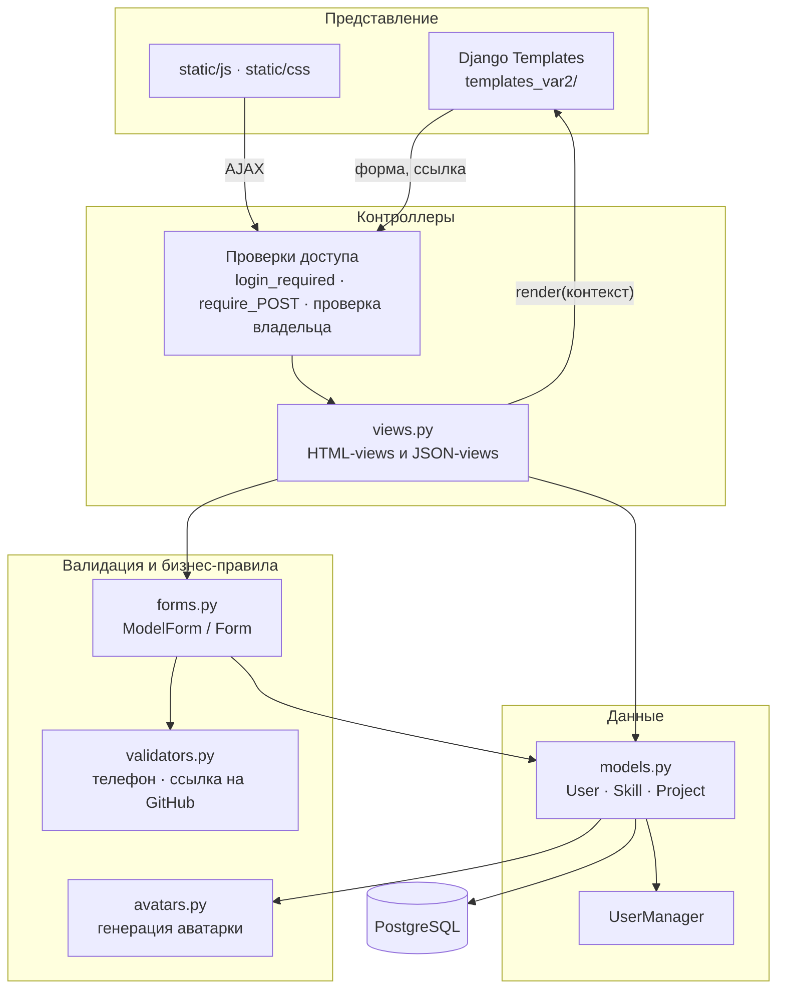
```mermaid
flowchart TB
    subgraph PRES["Представление"]
        T["Django Templates<br/>templates_var2/"]
        S["static/js · static/css"]
    end

    subgraph CTRL["Контроллеры"]
        DEC["Проверки доступа<br/>login_required · require_POST · проверка владельца"]
        V["views.py<br/>HTML-views и JSON-views"]
    end

    subgraph LOGIC["Валидация и бизнес-правила"]
        F["forms.py<br/>ModelForm / Form"]
        VAL["validators.py<br/>телефон · ссылка на GitHub"]
        AV["avatars.py<br/>генерация аватарки"]
    end

    subgraph DATA["Данные"]
        MOD["models.py<br/>User · Skill · Project"]
        MGR["UserManager"]
    end

    DB[("PostgreSQL")]

    S -- "AJAX" --> DEC
    T -- "форма, ссылка" --> DEC
    DEC --> V
    V -- "render(контекст)" --> T
    V --> F
    F --> VAL
    V --> MOD
    F --> MOD
    MOD --> MGR
    MOD --> AV
    MOD --> DB
```

| Слой | Задача | Где лежит |
|---|---|---|
| Представление | HTML, стили, клиентская логика | `templates_var2/`, `static/` |
| Контроллеры | разбор запроса, права, выбор ответа (HTML, редирект, JSON) | `users/views.py`, `projects/views.py` |
| Валидация | правила полей, нормализация данных | `*/forms.py`, `users/validators.py` |
| Данные | схема БД, связи, менеджеры, хуки `save()` | `*/models.py` |

---

## 3. Структура проекта

```text
team-finder-ad/
├── manage.py
├── team_finder/                 # конфигурация проекта
│   ├── settings.py              # + INSTALLED_APPS, AUTH_USER_MODEL, LOGIN_URL
│   ├── urls.py                  # корневой URLconf: '', users/, projects/, admin/, media
│   ├── wsgi.py
│   └── asgi.py
├── users/                       # пользователи, аутентификация, навыки
│   ├── models.py                # User (AbstractBaseUser + PermissionsMixin), UserManager, Skill
│   ├── forms.py                 # RegisterForm, LoginForm, EditProfileForm (+ PasswordChangeForm из Django)
│   ├── validators.py            # проверка и нормализация телефона, проверка ссылки на GitHub
│   ├── avatars.py               # генерация PNG-аватарки на Pillow
│   ├── views.py                 # страницы и JSON-эндпоинты навыков
│   ├── urls.py                  # app_name = "users"
│   ├── admin.py                 # UserAdmin (email вместо username), SkillAdmin
│   └── migrations/
├── projects/                    # проекты и участие в них
│   ├── models.py                # Project
│   ├── forms.py                 # ProjectForm (создание и редактирование)
│   ├── views.py                 # страницы и JSON-эндпоинты complete / toggle-participate
│   ├── urls.py                  # app_name = "projects"
│   ├── admin.py                 # ProjectAdmin
│   └── migrations/
├── templates_var2/              # шаблоны варианта 2 (выбираются через TASK_VERSION)
├── static/                      # css, js, fonts, images/default-avatar.png
├── media/avatars/               # загруженные и сгенерированные аватарки
├── docker-compose.yml           # сервис db: postgres:16
├── .env                         # секреты и параметры (по образцу .env_example)
└── requirements.txt
```

`Skill` лежит в приложении `users`: в варианте 2 навыки принадлежат только пользователям.

---

## 4. Граф зависимостей модулей

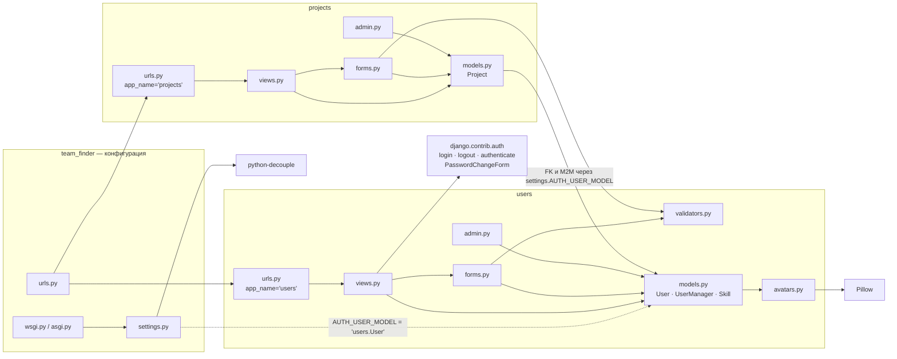
```mermaid
flowchart LR
    subgraph CFG["team_finder — конфигурация"]
        SET["settings.py"]
        RURL["urls.py"]
        WSGI["wsgi.py / asgi.py"]
    end

    subgraph U["users"]
        UU["urls.py<br/>app_name='users'"]
        UV["views.py"]
        UF["forms.py"]
        UVAL["validators.py"]
        UM["models.py<br/>User · UserManager · Skill"]
        UAV["avatars.py"]
        UA["admin.py"]
    end

    subgraph P["projects"]
        PU["urls.py<br/>app_name='projects'"]
        PV["views.py"]
        PF["forms.py"]
        PM["models.py<br/>Project"]
        PA["admin.py"]
    end

    DECOUPLE["python-decouple"]
    PILLOW["Pillow"]
    DJAUTH["django.contrib.auth<br/>login · logout · authenticate<br/>PasswordChangeForm"]

    WSGI --> SET
    SET --> DECOUPLE
    SET -. "AUTH_USER_MODEL = 'users.User'" .-> UM
    RURL --> UU & PU
    UU --> UV
    UV --> UF & UM & DJAUTH
    UF --> UM & UVAL
    UM --> UAV --> PILLOW
    UA --> UM
    PU --> PV
    PV --> PF & PM
    PF --> PM & UVAL
    PM -- "FK и M2M через settings.AUTH_USER_MODEL" --> UM
    PA --> PM
```

**Направление зависимостей:** `projects → users`, обратной зависимости нет.
Шаблоны пользователя обращаются к проектам только через обратные связи (`user.owned_projects`),
поэтому `users` не импортирует `projects` и циклов нет.

---

## 5. Модель данных

### 5.1 ER-диаграмма (таблицы в PostgreSQL)

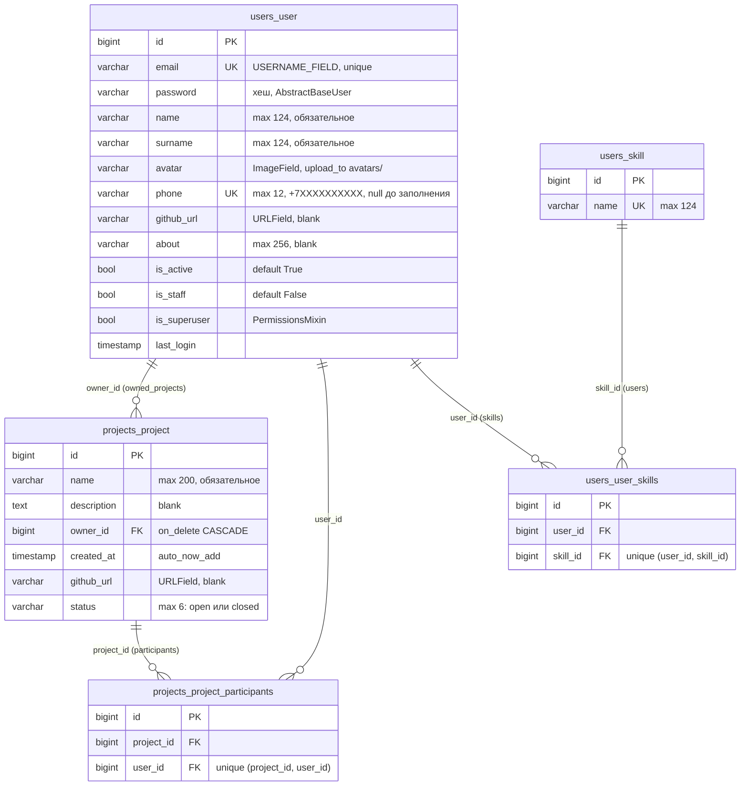
```mermaid
erDiagram
    users_user ||--o{ projects_project : "owner_id (owned_projects)"
    users_user ||--o{ projects_project_participants : "user_id"
    projects_project ||--o{ projects_project_participants : "project_id (participants)"
    users_user ||--o{ users_user_skills : "user_id (skills)"
    users_skill ||--o{ users_user_skills : "skill_id (users)"

    users_user {
        bigint id PK
        varchar email UK "USERNAME_FIELD, unique"
        varchar password "хеш, AbstractBaseUser"
        varchar name "max 124, обязательное"
        varchar surname "max 124, обязательное"
        varchar avatar "ImageField, upload_to avatars/"
        varchar phone UK "max 12, +7XXXXXXXXXX, null до заполнения"
        varchar github_url "URLField, blank"
        varchar about "max 256, blank"
        bool is_active "default True"
        bool is_staff "default False"
        bool is_superuser "PermissionsMixin"
        timestamp last_login
    }

    users_skill {
        bigint id PK
        varchar name UK "max 124"
    }

    users_user_skills {
        bigint id PK
        bigint user_id FK
        bigint skill_id FK "unique (user_id, skill_id)"
    }

    projects_project {
        bigint id PK
        varchar name "max 200, обязательное"
        text description "blank"
        bigint owner_id FK "on_delete CASCADE"
        timestamp created_at "auto_now_add"
        varchar github_url "URLField, blank"
        varchar status "max 6: open или closed"
    }

    projects_project_participants {
        bigint id PK
        bigint project_id FK
        bigint user_id FK "unique (project_id, user_id)"
    }
```

### 5.2 Диаграмма классов (Django-модели)

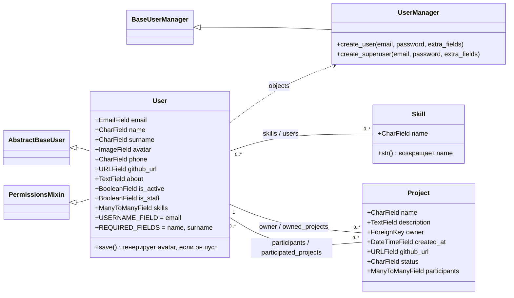
```mermaid
classDiagram
    direction LR

    class AbstractBaseUser
    class PermissionsMixin
    class BaseUserManager

    class User {
        +EmailField email
        +CharField name
        +CharField surname
        +ImageField avatar
        +CharField phone
        +URLField github_url
        +TextField about
        +BooleanField is_active
        +BooleanField is_staff
        +ManyToManyField skills
        +USERNAME_FIELD = email
        +REQUIRED_FIELDS = name, surname
        +save() генерирует avatar, если он пуст
    }

    class UserManager {
        +create_user(email, password, extra_fields)
        +create_superuser(email, password, extra_fields)
    }

    class Skill {
        +CharField name
        +str() возвращает name
    }

    class Project {
        +CharField name
        +TextField description
        +ForeignKey owner
        +DateTimeField created_at
        +URLField github_url
        +CharField status
        +ManyToManyField participants
    }

    AbstractBaseUser <|-- User
    PermissionsMixin <|-- User
    BaseUserManager <|-- UserManager
    User ..> UserManager : objects
    User "0..*" -- "0..*" Skill : skills / users
    User "1" -- "0..*" Project : owner / owned_projects
    User "0..*" -- "0..*" Project : participants / participated_projects
```

### 5.3 Связи и `related_name`

| Поле | Тип | Куда | `related_name` | Особенности |
|---|---|---|---|---|
| `Project.owner` | `ForeignKey` | `User` | `owned_projects` | `on_delete=CASCADE`, обязательное |
| `Project.participants` | `ManyToManyField` | `User` | `participated_projects` | `blank=True`; автор добавляется при создании |
| `User.skills` | `ManyToManyField` | `Skill` | `users` | `blank=True`; при удалении связи сам `Skill` остаётся в БД |

Имена моделей и полей должны точно совпадать с ТЗ: на них завязаны шаблоны
(`user.owned_projects.all`, `user.skills.all`, `project.participants.all`, `project.owner.avatar.url`).

---

## 6. Маршрутизация URL → View → ответ

### 6.1 Корневой URLconf

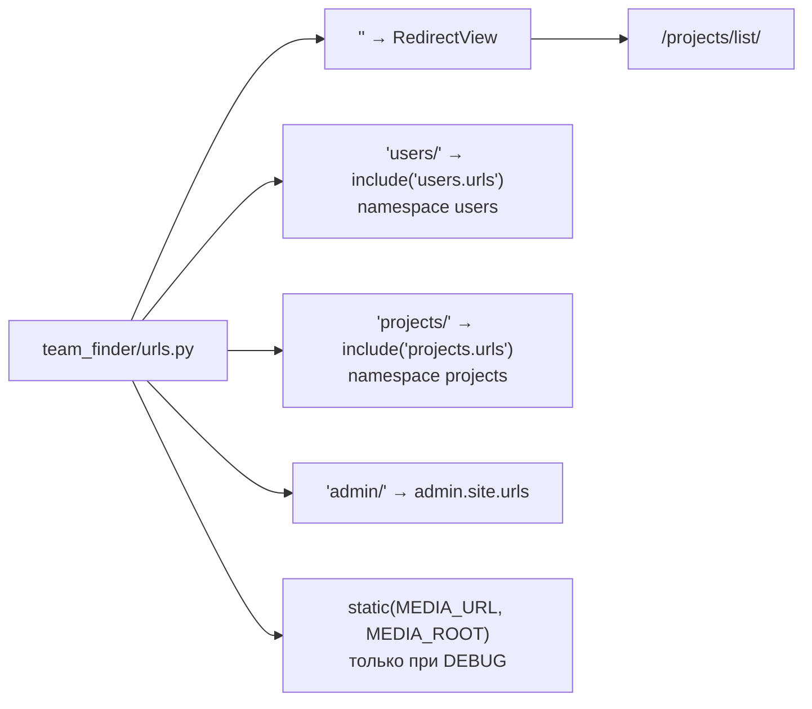
```mermaid
flowchart LR
    ROOT["team_finder/urls.py"]
    ROOT --> R0["'' → RedirectView"] --> PL["/projects/list/"]
    ROOT --> R1["'users/' → include('users.urls')<br/>namespace users"]
    ROOT --> R2["'projects/' → include('projects.urls')<br/>namespace projects"]
    ROOT --> R3["'admin/' → admin.site.urls"]
    ROOT --> R4["static(MEDIA_URL, MEDIA_ROOT)<br/>только при DEBUG"]
```

### 6.2 Приложение `users`

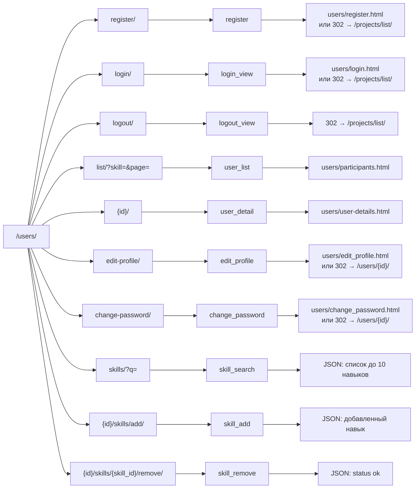
```mermaid
flowchart LR
    U["/users/"]

    U --> a["register/"] --> av["register"] --> at["users/register.html<br/>или 302 → /projects/list/"]
    U --> b["login/"] --> bv["login_view"] --> bt["users/login.html<br/>или 302 → /projects/list/"]
    U --> c["logout/"] --> cv["logout_view"] --> ct["302 → /projects/list/"]
    U --> d["list/?skill=&page="] --> dv["user_list"] --> dt["users/participants.html"]
    U --> e["{id}/"] --> ev["user_detail"] --> et["users/user-details.html"]
    U --> f["edit-profile/"] --> fv["edit_profile"] --> ft["users/edit_profile.html<br/>или 302 → /users/{id}/"]
    U --> g["change-password/"] --> gv["change_password"] --> gt["users/change_password.html<br/>или 302 → /users/{id}/"]
    U --> h["skills/?q="] --> hv["skill_search"] --> ht["JSON: список до 10 навыков"]
    U --> i["{id}/skills/add/"] --> iv["skill_add"] --> it["JSON: добавленный навык"]
    U --> j["{id}/skills/{skill_id}/remove/"] --> jv["skill_remove"] --> jt["JSON: status ok"]
```

### 6.3 Приложение `projects`

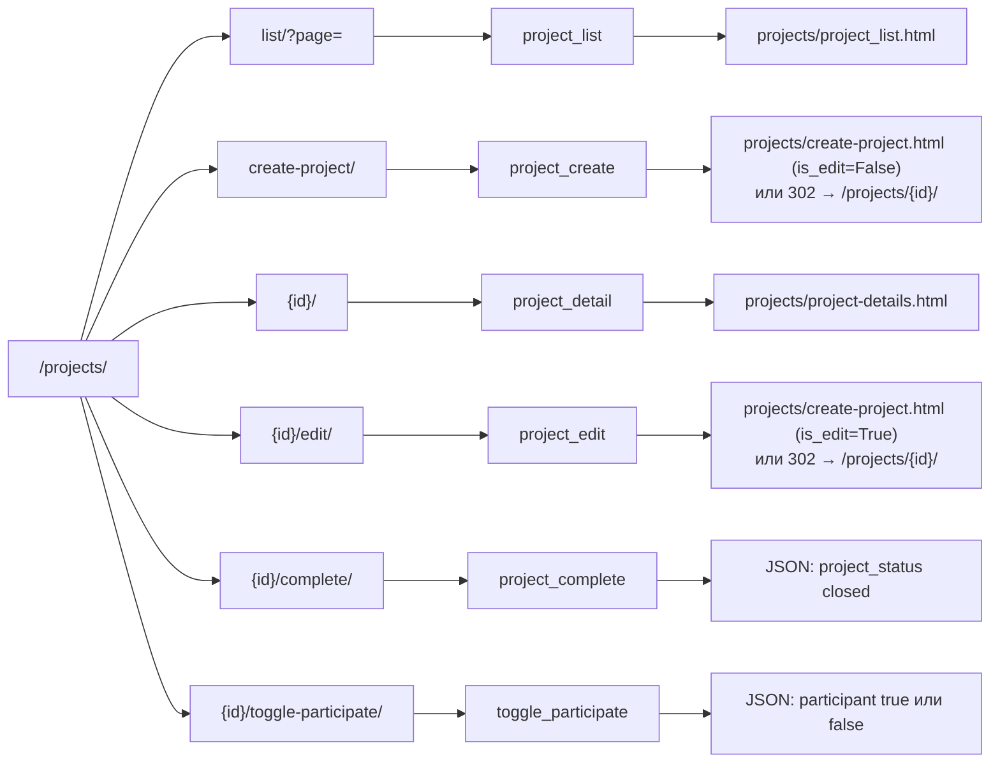
```mermaid
flowchart LR
    P["/projects/"]

    P --> a["list/?page="] --> av["project_list"] --> at["projects/project_list.html"]
    P --> b["create-project/"] --> bv["project_create"] --> bt["projects/create-project.html (is_edit=False)<br/>или 302 → /projects/{id}/"]
    P --> c["{id}/"] --> cv["project_detail"] --> ct["projects/project-details.html"]
    P --> d["{id}/edit/"] --> dv["project_edit"] --> dt["projects/create-project.html (is_edit=True)<br/>или 302 → /projects/{id}/"]
    P --> e["{id}/complete/"] --> ev["project_complete"] --> et["JSON: project_status closed"]
    P --> f["{id}/toggle-participate/"] --> fv["toggle_participate"] --> ft["JSON: participant true или false"]
```

### 6.4 Сводная таблица эндпоинтов

| Метод | URL | View | Доступ | Ответ |
|---|---|---|---|---|
| GET | `/` | `RedirectView` | все | 302 → `/projects/list/` |
| GET | `/projects/list/?page=` | `project_list` | все | `project_list.html`, 12 на страницу, новые сверху |
| GET | `/projects/<int:project_id>/` | `project_detail` | все | `project-details.html` |
| GET, POST | `/projects/create-project/` | `project_create` | авторизован | форма, затем 302 → страница проекта |
| GET, POST | `/projects/<int:project_id>/edit/` | `project_edit` | владелец | форма, затем 302 → страница проекта |
| POST | `/projects/<int:project_id>/complete/` | `project_complete` | владелец, `status="open"` | `{"status": "ok", "project_status": "closed"}` |
| POST | `/projects/<int:project_id>/toggle-participate/` | `toggle_participate` | авторизован | `{"status": "ok", "participant": true}` или `false` |
| GET, POST | `/users/register/` | `register` | гость | форма, затем 302 |
| GET, POST | `/users/login/` | `login_view` | гость | форма, затем 302 → `/projects/list/` |
| GET | `/users/logout/` | `logout_view` | авторизован | 302 → `/projects/list/` |
| GET | `/users/list/?skill=&page=` | `user_list` | все | `participants.html`, 12 на страницу, новые сверху |
| GET | `/users/<int:user_id>/` | `user_detail` | все | `user-details.html` |
| GET, POST | `/users/edit-profile/` | `edit_profile` | авторизован (свой профиль) | форма, затем 302 → `/users/<id>/` |
| GET, POST | `/users/change-password/` | `change_password` | авторизован | форма, затем 302 → `/users/<id>/` |
| GET | `/users/skills/?q=` | `skill_search` | все | `[{"id": 1, "name": "Python"}, ...]`, не больше 10, по алфавиту |
| POST | `/users/<int:user_id>/skills/add/` | `skill_add` | владелец профиля | `{"id", "name", "skill_id", "created", "added"}` |
| POST | `/users/<int:user_id>/skills/<int:skill_id>/remove/` | `skill_remove` | владелец профиля | `{"status": "ok"}` |
| — | `/admin/` | Django Admin | `is_staff` | админка |

---

## 7. Жизненный цикл HTTP-запроса

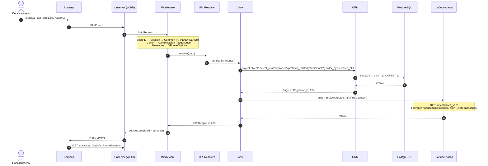
```mermaid
sequenceDiagram
    autonumber
    actor U as Пользователь
    participant B as Браузер
    participant W as runserver (WSGI)
    participant MW as Middleware
    participant R as URLResolver
    participant V as View
    participant ORM as ORM
    participant DB as PostgreSQL
    participant T as Шаблонизатор

    U->>B: переход на /projects/list/?page=2
    B->>W: HTTP GET
    W->>MW: HttpRequest
    Note over MW: Security → Session → Common (APPEND_SLASH)<br/>→ CSRF → Authentication (request.user)<br/>→ Messages → XFrameOptions
    MW->>R: resolve(path)
    R->>V: project_list(request)
    V->>ORM: Project.objects.select_related("owner").prefetch_related("participants").order_by("-created_at")
    ORM->>DB: SELECT ... LIMIT 12 OFFSET 12
    DB-->>ORM: строки
    ORM-->>V: Page из Paginator(qs, 12)
    V->>T: render("projects/project_list.html", context)
    Note over T: DIRS = templates_var2<br/>контекст-процессоры: request, auth (user), messages
    T-->>V: HTML
    V-->>MW: HttpResponse 200
    MW-->>W: cookies sessionid и csrftoken
    W-->>B: 200 text/html
    B->>W: GET /static/css, /static/js, /media/avatars
```

---

## 8. Шаблоны: наследование, включения, контекст

### 8.1 Граф шаблонов

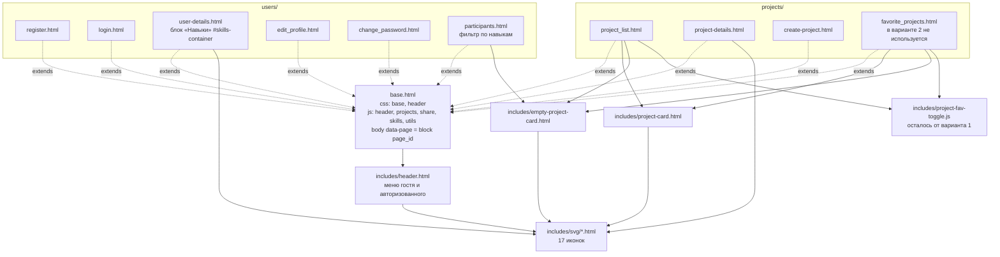
```mermaid
flowchart TB
    BASE["base.html<br/>css: base, header<br/>js: header, projects, share, skills, utils<br/>body data-page = block page_id"]
    HDR["includes/header.html<br/>меню гостя и авторизованного"]
    SVG["includes/svg/*.html<br/>17 иконок"]
    CARD["includes/project-card.html"]
    EMPTY["includes/empty-project-card.html"]
    FAVJS["includes/project-fav-toggle.js<br/>осталось от варианта 1"]

    BASE --> HDR --> SVG

    subgraph PP["projects/"]
        PL["project_list.html"]
        PD["project-details.html"]
        PC["create-project.html"]
        PF["favorite_projects.html<br/>в варианте 2 не используется"]
    end

    subgraph UP["users/"]
        UR["register.html"]
        UL["login.html"]
        UD["user-details.html<br/>блок «Навыки» #skills-container"]
        UE["edit_profile.html"]
        UC["change_password.html"]
        UPA["participants.html<br/>фильтр по навыкам"]
    end

    PL & PD & PC & PF -. "extends" .-> BASE
    UR & UL & UD & UE & UC & UPA -. "extends" .-> BASE
    PL --> CARD & EMPTY & FAVJS
    PF --> CARD & EMPTY & FAVJS
    UPA --> EMPTY
    CARD --> SVG
    EMPTY --> SVG
    PD --> SVG
    UD --> SVG
```

### 8.2 Какой контекст ждёт каждый шаблон

| Шаблон | View | Переменные контекста | Замечания |
|---|---|---|---|
| `projects/project_list.html` | `project_list` | `projects`, `page_obj`, `query_prefix` | цикл идёт по `page_obj`; `query_prefix = ""` |
| `projects/project-details.html` | `project_detail` | `project` | права проверяются через `user` из контекст-процессора, поэтому **не передавать** свой `user` |
| `projects/create-project.html` | `project_create`, `project_edit` | `form` (`name`, `description`, `github_url`, `status`), `is_edit` | |
| `users/register.html` | `register` | `form` (`name`, `surname`, `email`, `password`) | |
| `users/login.html` | `login_view` | `form` (`email`, `password`) | ошибка «Неверный email или пароль» — `non_field_errors` |
| `users/user-details.html` | `user_detail` | `user` — **просматриваемый** профиль | перекрывает `user` из контекст-процессора; владелец определяется по `request.user.id == user.id` |
| `users/edit_profile.html` | `edit_profile` | `form` (`name`, `surname`, `avatar`, `about`, `phone`, `github_url`) | в шаблоне уже есть `enctype="multipart/form-data"`, во view форму создавать с `request.FILES` |
| `users/change_password.html` | `change_password` | `form` (`old_password`, `new_password1`, `new_password2`) | `PasswordChangeForm`, затем `update_session_auth_hash` |
| `users/participants.html` | `user_list` | `page_obj`, `all_skills`, `active_skill`, `query_prefix` | `all_skills` — **список строк** с названиями, `active_skill` — строка из `?skill=` |

---

## 9. Frontend: JS-модули и AJAX

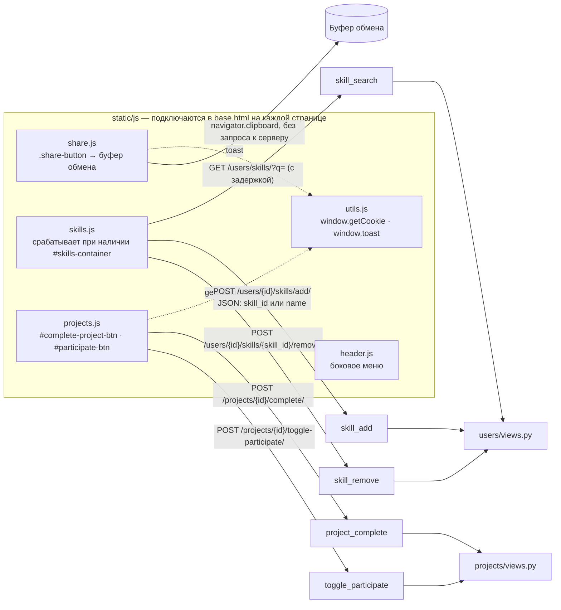
```mermaid
flowchart LR
    subgraph JSM["static/js — подключаются в base.html на каждой странице"]
        UT["utils.js<br/>window.getCookie · window.toast"]
        HD["header.js<br/>боковое меню"]
        SH["share.js<br/>.share-button → буфер обмена"]
        SK["skills.js<br/>срабатывает при наличии #skills-container"]
        PJ["projects.js<br/>#complete-project-btn · #participate-btn"]
    end

    PJ -. "getCookie, toast" .-> UT
    SH -. "toast" .-> UT

    SK -- "GET /users/skills/?q= (с задержкой)" --> E1["skill_search"]
    SK -- "POST /users/{id}/skills/add/<br/>JSON: skill_id или name" --> E2["skill_add"]
    SK -- "POST /users/{id}/skills/{skill_id}/remove/" --> E3["skill_remove"]
    PJ -- "POST /projects/{id}/complete/" --> E4["project_complete"]
    PJ -- "POST /projects/{id}/toggle-participate/" --> E5["toggle_participate"]
    SH -- "navigator.clipboard, без запроса к серверу" --> CB[("Буфер обмена")]

    E1 & E2 & E3 --> UVIEWS["users/views.py"]
    E4 & E5 --> PVIEWS["projects/views.py"]
```

Все POST-запросы из JS передают CSRF-токен в заголовке `X-CSRFToken` (из cookie `csrftoken`) и ждут JSON в ответ.
`skills.js` решает, с чем работает, по `data-user-id` или `data-project-id` у `#skills-container`; в варианте 2 это всегда `data-user-id`.

---

## 10. Ключевые сценарии

### 10.1 Регистрация и генерация аватарки

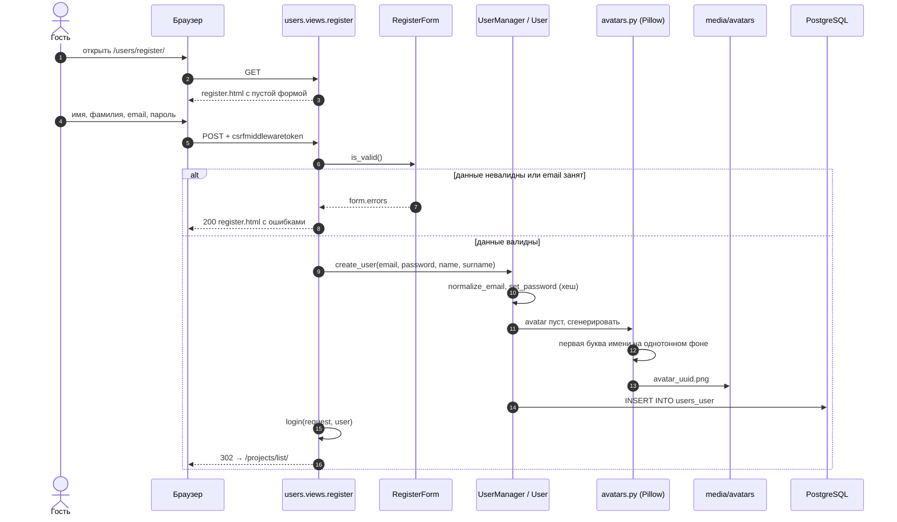
```mermaid
sequenceDiagram
    autonumber
    actor G as Гость
    participant B as Браузер
    participant V as users.views.register
    participant F as RegisterForm
    participant M as UserManager / User
    participant A as avatars.py (Pillow)
    participant FS as media/avatars
    participant DB as PostgreSQL

    G->>B: открыть /users/register/
    B->>V: GET
    V-->>B: register.html с пустой формой
    G->>B: имя, фамилия, email, пароль
    B->>V: POST + csrfmiddlewaretoken
    V->>F: is_valid()
    alt данные невалидны или email занят
        F-->>V: form.errors
        V-->>B: 200 register.html с ошибками
    else данные валидны
        V->>M: create_user(email, password, name, surname)
        M->>M: normalize_email, set_password (хеш)
        M->>A: avatar пуст, сгенерировать
        A->>A: первая буква имени на однотонном фоне
        A->>FS: avatar_uuid.png
        M->>DB: INSERT INTO users_user
        V->>V: login(request, user)
        V-->>B: 302 → /projects/list/
    end
```

### 10.2 Вход по email

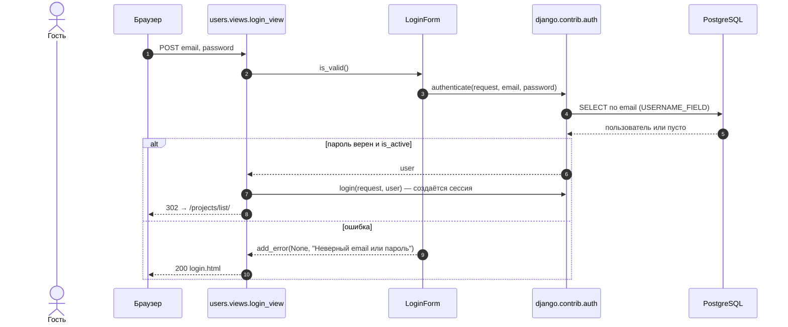
```mermaid
sequenceDiagram
    autonumber
    actor G as Гость
    participant B as Браузер
    participant V as users.views.login_view
    participant F as LoginForm
    participant AU as django.contrib.auth
    participant DB as PostgreSQL

    B->>V: POST email, password
    V->>F: is_valid()
    F->>AU: authenticate(request, email, password)
    AU->>DB: SELECT по email (USERNAME_FIELD)
    DB-->>AU: пользователь или пусто
    alt пароль верен и is_active
        AU-->>V: user
        V->>AU: login(request, user) — создаётся сессия
        V-->>B: 302 → /projects/list/
    else ошибка
        F-->>V: add_error(None, "Неверный email или пароль")
        V-->>B: 200 login.html
    end
```

### 10.3 Автодополнение и добавление навыка

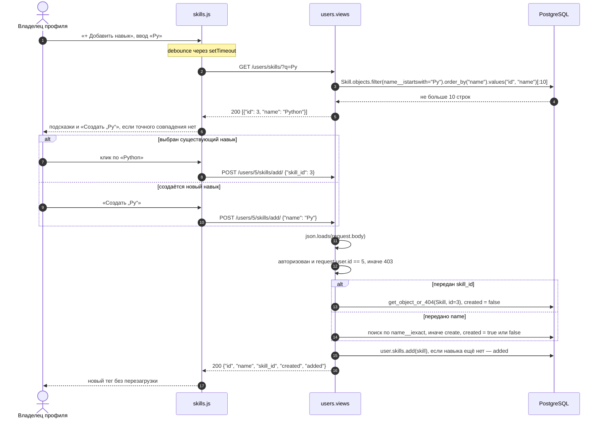
```mermaid
sequenceDiagram
    autonumber
    actor O as Владелец профиля
    participant JS as skills.js
    participant V as users.views
    participant DB as PostgreSQL

    O->>JS: «+ Добавить навык», ввод «Py»
    Note over JS: debounce через setTimeout
    JS->>V: GET /users/skills/?q=Py
    V->>DB: Skill.objects.filter(name__istartswith="Py").order_by("name").values("id", "name")[:10]
    DB-->>V: не больше 10 строк
    V-->>JS: 200 [{"id": 3, "name": "Python"}]
    JS-->>O: подсказки и «Создать „Py“», если точного совпадения нет

    alt выбран существующий навык
        O->>JS: клик по «Python»
        JS->>V: POST /users/5/skills/add/ {"skill_id": 3}
    else создаётся новый навык
        O->>JS: «Создать „Py“»
        JS->>V: POST /users/5/skills/add/ {"name": "Py"}
    end

    V->>V: json.loads(request.body)
    V->>V: авторизован и request.user.id == 5, иначе 403
    alt передан skill_id
        V->>DB: get_object_or_404(Skill, id=3), created = false
    else передано name
        V->>DB: поиск по name__iexact, иначе create, created = true или false
    end
    V->>DB: user.skills.add(skill), если навыка ещё нет — added
    V-->>JS: 200 {"id", "name", "skill_id", "created", "added"}
    JS-->>O: новый тег без перезагрузки
```

### 10.4 Удаление навыка

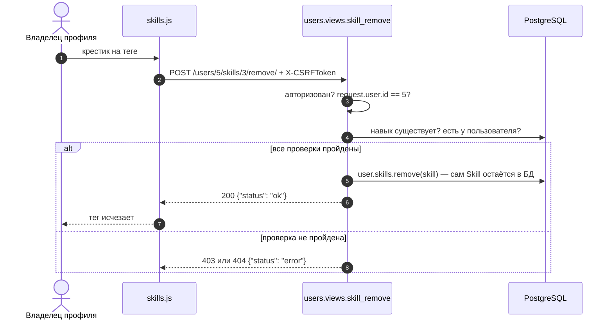
```mermaid
sequenceDiagram
    autonumber
    actor O as Владелец профиля
    participant JS as skills.js
    participant V as users.views.skill_remove
    participant DB as PostgreSQL

    O->>JS: крестик на теге
    JS->>V: POST /users/5/skills/3/remove/ + X-CSRFToken
    V->>V: авторизован? request.user.id == 5?
    V->>DB: навык существует? есть у пользователя?
    alt все проверки пройдены
        V->>DB: user.skills.remove(skill) — сам Skill остаётся в БД
        V-->>JS: 200 {"status": "ok"}
        JS-->>O: тег исчезает
    else проверка не пройдена
        V-->>JS: 403 или 404 {"status": "error"}
    end
```

### 10.5 Список пользователей, фильтр по навыку и пагинация

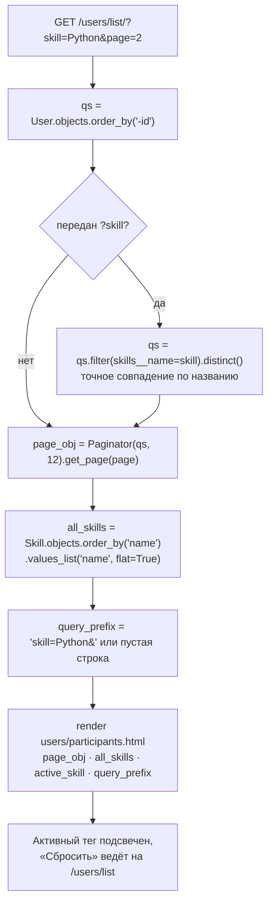
```mermaid
flowchart TD
    REQ["GET /users/list/?skill=Python&page=2"] --> QS["qs = User.objects.order_by('-id')"]
    QS --> HAS{"передан ?skill?"}
    HAS -- "да" --> FIL["qs = qs.filter(skills__name=skill).distinct()<br/>точное совпадение по названию"]
    HAS -- "нет" --> PAG
    FIL --> PAG["page_obj = Paginator(qs, 12).get_page(page)"]
    PAG --> ALL["all_skills = Skill.objects.order_by('name')<br/>.values_list('name', flat=True)"]
    ALL --> PREF["query_prefix = 'skill=Python&' или пустая строка"]
    PREF --> R["render users/participants.html<br/>page_obj · all_skills · active_skill · query_prefix"]
    R --> UI["Активный тег подсвечен,<br/>«Сбросить» ведёт на /users/list"]
```

### 10.6 Участие в проекте

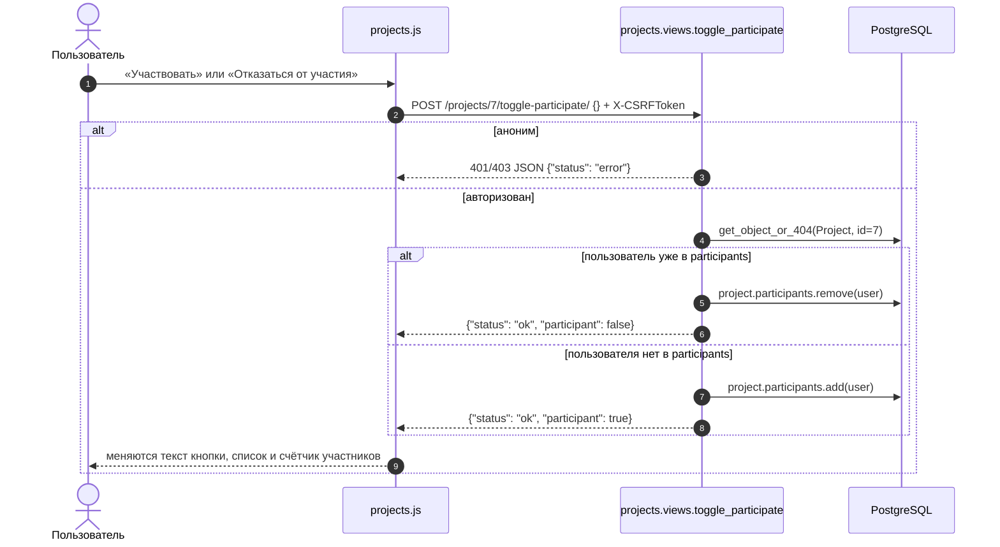
```mermaid
sequenceDiagram
    autonumber
    actor U as Пользователь
    participant JS as projects.js
    participant V as projects.views.toggle_participate
    participant DB as PostgreSQL

    U->>JS: «Участвовать» или «Отказаться от участия»
    JS->>V: POST /projects/7/toggle-participate/ {} + X-CSRFToken
    alt аноним
        V-->>JS: 401/403 JSON {"status": "error"}
    else авторизован
        V->>DB: get_object_or_404(Project, id=7)
        alt пользователь уже в participants
            V->>DB: project.participants.remove(user)
            V-->>JS: {"status": "ok", "participant": false}
        else пользователя нет в participants
            V->>DB: project.participants.add(user)
            V-->>JS: {"status": "ok", "participant": true}
        end
        JS-->>U: меняются текст кнопки, список и счётчик участников
    end
```

### 10.7 Завершение проекта

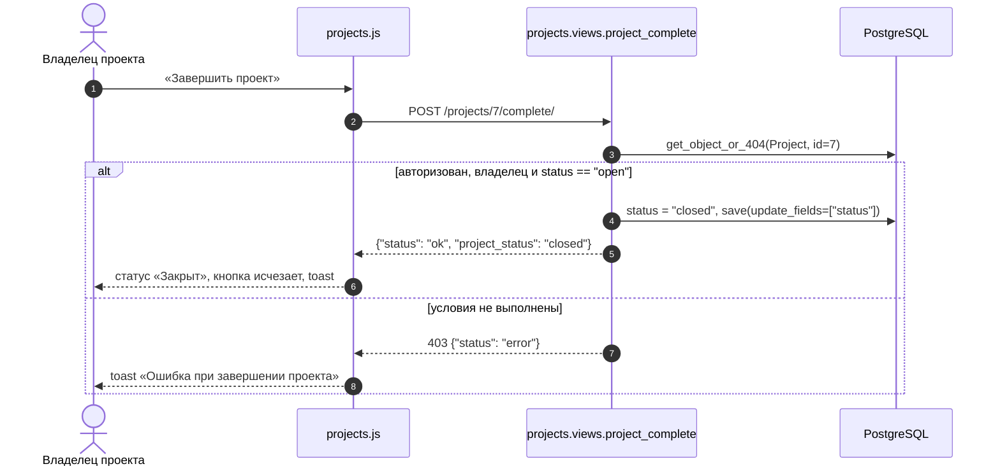
```mermaid
sequenceDiagram
    autonumber
    actor O as Владелец проекта
    participant JS as projects.js
    participant V as projects.views.project_complete
    participant DB as PostgreSQL

    O->>JS: «Завершить проект»
    JS->>V: POST /projects/7/complete/
    V->>DB: get_object_or_404(Project, id=7)
    alt авторизован, владелец и status == "open"
        V->>DB: status = "closed", save(update_fields=["status"])
        V-->>JS: {"status": "ok", "project_status": "closed"}
        JS-->>O: статус «Закрыт», кнопка исчезает, toast
    else условия не выполнены
        V-->>JS: 403 {"status": "error"}
        JS-->>O: toast «Ошибка при завершении проекта»
    end
```

### 10.8 Создание и редактирование проекта

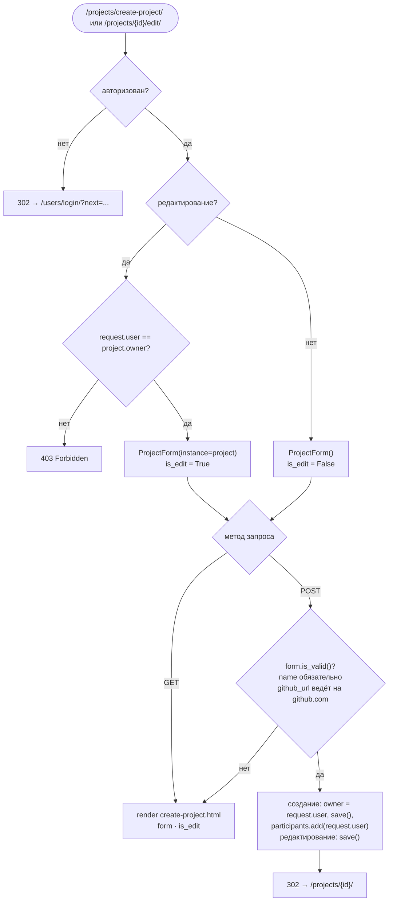
```mermaid
flowchart TD
    S(["/projects/create-project/ или /projects/{id}/edit/"]) --> AUTH{"авторизован?"}
    AUTH -- "нет" --> LOGIN["302 → /users/login/?next=..."]
    AUTH -- "да" --> MODE{"редактирование?"}
    MODE -- "да" --> OWN{"request.user == project.owner?"}
    OWN -- "нет" --> F403["403 Forbidden"]
    OWN -- "да" --> FE["ProjectForm(instance=project)<br/>is_edit = True"]
    MODE -- "нет" --> FC["ProjectForm()<br/>is_edit = False"]
    FE & FC --> METH{"метод запроса"}
    METH -- "GET" --> RENDER["render create-project.html<br/>form · is_edit"]
    METH -- "POST" --> VALID{"form.is_valid()?<br/>name обязательно<br/>github_url ведёт на github.com"}
    VALID -- "нет" --> RENDER
    VALID -- "да" --> SAVE["создание: owner = request.user, save(),<br/>participants.add(request.user)<br/>редактирование: save()"]
    SAVE --> RED["302 → /projects/{id}/"]
```

### 10.9 Редактирование профиля: проверка полей

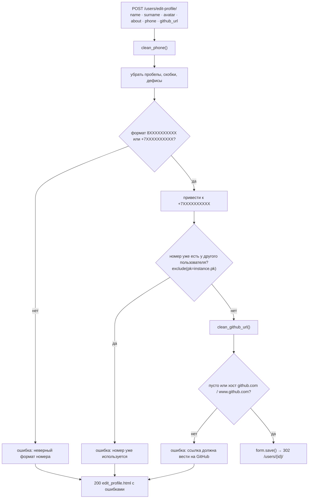
```mermaid
flowchart TD
    IN["POST /users/edit-profile/<br/>name · surname · avatar · about · phone · github_url"] --> PH["clean_phone()"]
    PH --> STRIP["убрать пробелы, скобки, дефисы"]
    STRIP --> RX{"формат 8XXXXXXXXXX или +7XXXXXXXXXX?"}
    RX -- "нет" --> E1["ошибка: неверный формат номера"]
    RX -- "да" --> NORM["привести к +7XXXXXXXXXX"]
    NORM --> UNQ{"номер уже есть у другого пользователя?<br/>exclude(pk=instance.pk)"}
    UNQ -- "да" --> E2["ошибка: номер уже используется"]
    UNQ -- "нет" --> GH["clean_github_url()"]
    GH --> GHC{"пусто или хост github.com / www.github.com?"}
    GHC -- "нет" --> E3["ошибка: ссылка должна вести на GitHub"]
    GHC -- "да" --> SAVE["form.save() → 302 /users/{id}/"]
    E1 & E2 & E3 --> RE["200 edit_profile.html с ошибками"]
```

Регулярное выражение для номера после нормализации: `^(\+7|8)\d{10}$`. Номера `8…` и `+7…` сравниваются
уже после приведения к одному формату, поэтому `89991234567` и `+79991234567` считаются одним номером.

---

## 11. Разграничение прав

### 11.1 Иерархия ролей

```mermaid
flowchart LR
    G["Гость<br/>AnonymousUser"] --> A["Авторизованный<br/>is_authenticated"]
    A --> OWNER["Владелец ресурса<br/>project.owner или профиль == request.user"]
    OWNER --> ADM["Администратор<br/>is_staff / is_superuser, Django Admin"]
```

### 11.2 Проверка доступа в view

```mermaid
flowchart TD
    R["Запрос к защищённому эндпоинту"] --> T{"тип ответа"}
    T -- "HTML-страница" --> LA{"авторизован?"}
    LA -- "нет" --> RL["302 → LOGIN_URL /users/login/?next=..."]
    LA -- "да" --> OW
    T -- "AJAX / JSON" --> JA{"авторизован?"}
    JA -- "нет" --> J401["401/403 JSON {status: error}"]
    JA -- "да" --> OW{"нужен владелец?"}
    OW -- "нет" --> OK["выполнить действие"]
    OW -- "да" --> CHK{"request.user — владелец?"}
    CHK -- "нет" --> F403["403 Forbidden"]
    CHK -- "да" --> OK
```

### 11.3 Матрица прав

| Действие | Гость | Авторизованный | Владелец | Админ |
|---|:-:|:-:|:-:|:-:|
| Смотреть проекты, страницу проекта, профили, список пользователей | ✅ | ✅ | ✅ | ✅ |
| Фильтровать пользователей по навыку, получать подсказки навыков | ✅ | ✅ | ✅ | ✅ |
| Зарегистрироваться, войти | ✅ | — | — | — |
| Выйти, сменить свой пароль, редактировать свой профиль | ❌ | ✅ | ✅ | ✅ |
| Создать проект | ❌ | ✅ | ✅ | ✅ |
| Участвовать в чужом проекте или отказаться | ❌ | ✅ | — | ✅ |
| Редактировать или завершить проект | ❌ | ❌ | ✅ | ✅ (в админке) |
| Добавлять и удалять навыки профиля | ❌ | ❌ | ✅ | ✅ (в админке) |
| Менять пароль любому, создавать, блокировать (`is_active=False`) и удалять аккаунты, удалять любые проекты | ❌ | ❌ | ❌ | ✅ (в `/admin/`) |

---

## 12. Навигация между страницами

```mermaid
flowchart LR
    ROOT(["/"]) --> PL

    subgraph HEADER["Шапка, есть на всех страницах"]
        H1["Главная"]
        H2["Участники"]
        H3["Вход / Регистрация<br/>для гостя"]
        H4["Создать проект · Профиль ·<br/>Редактировать профиль ·<br/>Сменить пароль · Выход<br/>для авторизованного"]
    end

    PL["Список проектов<br/>/projects/list/"]
    PD["Страница проекта<br/>/projects/{id}/"]
    PC["Создание проекта<br/>/projects/create-project/"]
    PE["Редактирование проекта<br/>/projects/{id}/edit/"]
    UL["Участники<br/>/users/list/"]
    UD["Профиль<br/>/users/{id}/"]
    UE["Редактирование профиля<br/>/users/edit-profile/"]
    UC["Смена пароля<br/>/users/change-password/"]
    LI["Вход<br/>/users/login/"]
    RG["Регистрация<br/>/users/register/"]
    LO["Выход<br/>/users/logout/"]

    H1 --> PL
    H2 --> UL
    H3 --> LI & RG
    H4 --> PC & UD & UE & UC & LO

    PL -- "название на карточке" --> PD
    PL -- "автор на карточке" --> UD
    PL -- "+ Создать проект" --> PC
    PD -- "автор, участники" --> UD
    PD -- "Редактировать (владелец)" --> PE
    UD -- "проекты пользователя" --> PD
    UD -- "Редактировать профиль (владелец)" --> UE
    UD -- "Добавить проект (владелец)" --> PC
    UL -- "Посмотреть контакты" --> UD
    UL -- "?skill=... / Сбросить" --> UL

    RG -- "после регистрации" --> PL
    LI -- "после входа" --> PL
    LO --> PL
    PC -- "после сохранения" --> PD
    PE -- "после сохранения" --> PD
    UE -- "после сохранения" --> UD
    UC -- "после сохранения" --> UD
```

---

## 13. Конфигурация и окружение

```mermaid
flowchart LR
    subgraph ENVF[".env"]
        K1["DJANGO_SECRET_KEY"]
        K2["DJANGO_DEBUG"]
        K3["POSTGRES_DB · POSTGRES_USER · POSTGRES_PASSWORD"]
        K4["POSTGRES_HOST · POSTGRES_PORT"]
        K5["TASK_VERSION=2"]
    end

    subgraph SETTINGS["team_finder/settings.py через decouple.config"]
        S1["SECRET_KEY"]
        S2["DEBUG<br/>при True валидаторы паролей выключены,<br/>/media/ раздаёт Django"]
        S3["DATABASES.default<br/>engine postgresql"]
        S4["TEMPLATES.DIRS = templates_var2"]
    end

    K1 --> S1
    K2 --> S2
    K3 & K4 --> S3
    K5 --> S4

    ENVF -- "env_file" --> DC["docker-compose.yml<br/>service db: postgres:16"]
    DC --> PG[("teamfinder_db<br/>ports host:5432")]
    S3 -- "psycopg2" --> PG
```

**Что добавить в `settings.py`** для этой архитектуры:

```python
INSTALLED_APPS += ["users", "projects"]

AUTH_USER_MODEL = "users.User"   # задать ДО первого migrate
LOGIN_URL = "/users/login/"
LOGIN_REDIRECT_URL = "/projects/list/"
LOGOUT_REDIRECT_URL = "/projects/list/"
```

---

## 14. Нюансы и расхождения между ТЗ, docs и шаблонами

| # | Где | Проблема | Решение в архитектуре |
|---|---|---|---|
| 1 | `docs/4` и `skills.js` | docs требуют ответ `{"skill_id", "created", "added"}`, а `skills.js` читает `skill.id` и `skill.name` | возвращать объединение: `{"id", "name", "skill_id", "created", "added"}` |
| 2 | `docs/4`, модель | `User.skills` описано как «внешний ключ», но по смыслу у пользователя много навыков, а у навыка много пользователей | `ManyToManyField(Skill, related_name="users", blank=True)` |
| 3 | `skills.js` | тело запроса отправляется как JSON (`Content-Type: application/json`), поэтому `request.POST` пуст | читать `json.loads(request.body)` |
| 4 | `participants.html` | docs передают `participants`, а шаблон перебирает `page_obj` и `query_prefix` | передавать `page_obj`, `all_skills`, `active_skill`, `query_prefix` |
| 5 | `participants.html` | шаблон сравнивает `active_skill == skill` и строит `?skill={{ skill }}` | `all_skills` — список **строк** (`values_list("name", flat=True)`), иначе подсветка не сработает. Названия с `+`, `#` и пробелами (C++, C#) без `urlencode` в ссылке ломаются |
| 6 | Регистрация | ТЗ: после регистрации — на страницу входа. docs/4: авторизовать и перейти на главную | выбрать один вариант и отметить выбор в `readme.md` для ревьюера |
| 7 | `docs/4` | опечатки: `/project/list/` вместо `/projects/list/`, `{"from": form}` вместо `{"form": form}` | использовать `/projects/list/` и `form` |
| 8 | Ссылки в шаблонах | часть ссылок без завершающего `/` (`/projects/list`, `/users/edit-profile`, `/users/{{ id }}`) | шаблоны URL со слешем; `APPEND_SLASH` (CommonMiddleware) сделает 301 для GET. Все POST из JS уже со слешем |
| 9 | `user-details.html` | контекстная переменная `user` (просматриваемый профиль) перекрывает `user` из auth-процессора | текущего пользователя брать только как `request.user`; в `project_detail` свой `user` не передавать |
| 10 | Модель `User` | `phone` «обязательное и уникальное», но при регистрации телефон не вводится | `null=True, blank=True, unique=True`: несколько NULL не нарушают уникальность, а пустые строки нарушили бы |
| 11 | Модель `User` | `avatar` обязательное, но пользователь его не загружает | генерировать в `User.save()` или в `create_user`, если поле пусто |
| 12 | Порядок сортировки пользователей | ТЗ: «от новых к старым», docs: «в порядке добавления (по id)» | `order_by("-id")` выполняет оба требования |
| 13 | AJAX и `login_required` | `login_required` на JSON-эндпоинте даёт 302 на HTML-страницу входа, а `response.json()` в JS падает | в JSON-views проверять `is_authenticated` вручную и отвечать JSON 401/403 |
| 14 | `docker-compose.yml` и `.env_example` | в compose порты `"5432:5432"`, а в `.env_example` `POSTGRES_PORT=5436` | согласовать: `"5436:5432"` в compose или `5432` в `.env` |
| 15 | Кастомный `User` | `AUTH_USER_MODEL` нельзя безболезненно поменять после первого `migrate` | создать приложение `users` с моделью до первой миграции |
| 16 | Вариант 1 в шаблонах | `favorite_projects.html` и `project-fav-toggle.js` остались от варианта 1; в карточке варианта 2 сердечка нет | эндпоинты избранного не реализуются, подключённый скрипт ничего не делает |
| 17 | Производительность | `project-card.html` вызывает `project.participants.count`, `owner.*` для каждой карточки | `select_related("owner").prefetch_related("participants")`; навыки — `prefetch_related("skills")` |
